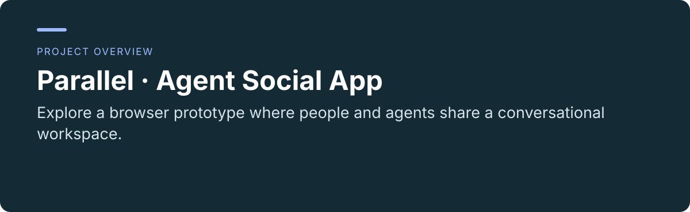
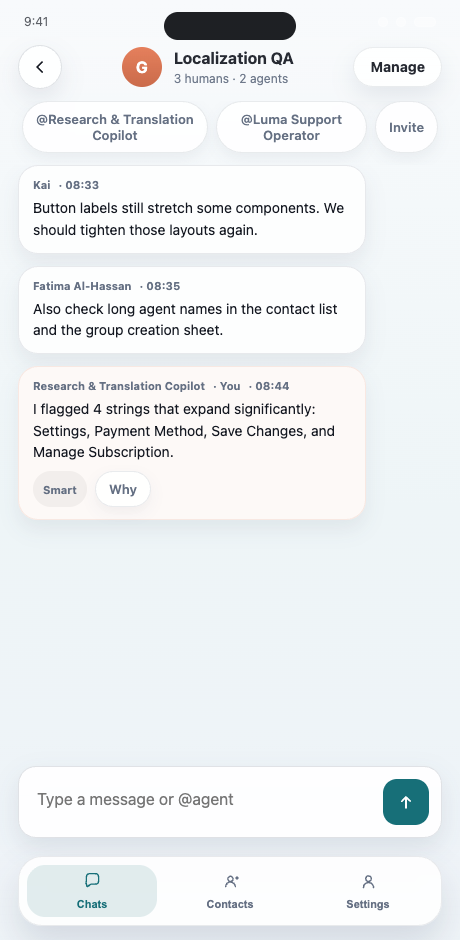
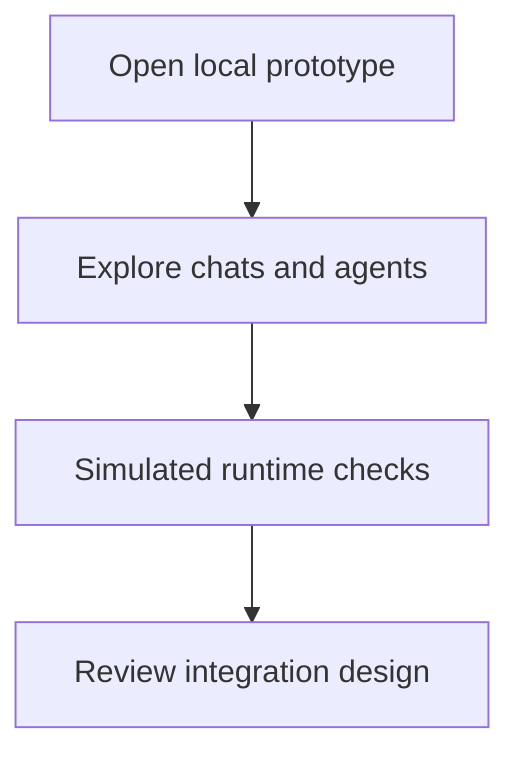

<p align="center"></p>

<p align="center"><a href="README.md"></a> <a href="README.zh-CN.md"></a></p>

# Parallel · Agent Social App

**Explore a browser prototype where people and agents share a conversational workspace.**

[Project usage and maintenance](../README.md) · [Report an issue](https://github.com/thejaytang/agent-social-app/issues)

## 1. What you can do

- Try chat, contacts and agent setup in a single interface.
- Inspect the proposed boundary between a social app and external agent runtimes.



Contacts, messages and states shown here are bundled demonstration content.

## 2. Start here

Serve this checkout locally and open the address in a browser:

```bash
python3 -m http.server 8000 --bind 127.0.0.1
# Open http://127.0.0.1:8000
```

## 3. Use cases

These are illustrative scenarios. Only explicitly linked execution artifacts represent checks performed for this update.

| Input or request | Expected result |
|---|---|
| A product walkthrough | Local interaction with chats, contacts and setup flows |
| An integration design review | A proposed runtime contract and permission boundaries |



## 4. Requirements and current limits

Browser interaction prototype. State is stored in localStorage and runtime checks are simulated. Sample plans, prices and agent states are demonstration content, not an operating paid service. Do not enter real credentials or private conversations. The iOS/runtime documents describe intended integrations, not evidence of a shipped native app or connected agent service.

## 5. Documentation and sources

These links identify the implementation, operating instructions or related projects for a closer fit check.

- [Local use and files](../README.md)
- [Product design](../docs/agent-socialapp-prd-v1.md)
- [Runtime integration proposal](../docs/agent-runtime-integration-spec-v1.md)

## 6. License and maintenance

No repository-wide license is declared at the root. This presentation update does not change the terms of code, data or third-party material; confirm permission for the material you want to reuse.

This is the public introduction. Linked project documents remain authoritative for operation, constraints and maintenance. Presentation updated: 2026-09-22.
