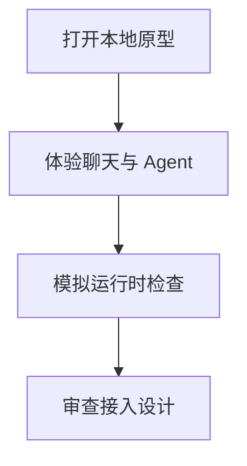

<p align="center"></p>

<p align="center"><a href="README.md"></a> <a href="README.zh-CN.md"></a></p>

# Parallel · Agent Social App

**体验一个让人和 Agent 共享会话空间的浏览器交互原型。**

[项目使用与维护入口](../README.md) · [报告问题](https://github.com/thejaytang/agent-social-app/issues)

## 1. 能完成什么

- 在同一界面体验聊天、联系人和 Agent 设置。
- 查看社交应用与外部 Agent 运行环境之间的接入设计。


截图中的联系人、消息与状态为内置演示内容。

## 2. 从这里开始

在仓库根目录启动本地静态服务，再在浏览器打开地址：

```bash
python3 -m http.server 8000 --bind 127.0.0.1
# Open http://127.0.0.1:8000
```

## 3. 使用场景

以下为说明性场景；只有明确链接的运行产物才代表本次检查结果。

| 输入或请求 | 预期结果 |
|---|---|
| 产品演示 | 在本地体验聊天、联系人与设置流程 |
| 集成设计审查 | 拟议的运行时契约与权限边界 |



## 4. 使用条件与当前边界

浏览器交互原型，状态保存在 localStorage，运行时检查为模拟。套餐、价格和 Agent 状态为演示内容，不代表已运行的付费服务。不要输入真实凭据或私人对话。iOS 与运行时文档描述拟议集成，不证明已有正式原生应用或接通的 Agent 服务。

## 5. 资料与来源

下面链接指向实现、操作说明或相关项目，便于进一步判断适用性。

- [本地使用与文件](../README.md)
- [产品设计](../docs/agent-socialapp-prd-v1.md)
- [运行时集成方案](../docs/agent-runtime-integration-spec-v1.md)

## 6. 许可与维护

仓库尚未在根目录声明统一许可证；本次展示更新没有改变代码、数据或第三方材料的许可。复用前请确认对应材料的授权。

本页为对外介绍。具体操作、约束和维护说明以链接的项目文档为准。展示页更新：2026-09-22。
